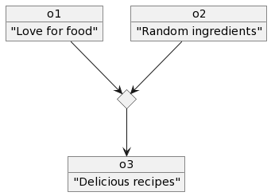

Lumache - quick recipe generation in Python!
===================================

Hi I am maintaining here a documentation for **Lumache** (/lu'make/)- a Python library for cooks and food lovers
that creates recipes mixing random ingredients.
It pulls data from the `Open Food Facts database <https://world.openfoodfacts.org/>`_
and offers a *simple* and *intuitive* API.Lumache has its documentation hosted on Read the Docs.

Check out the :doc:`usage` section for further information, including
how to :ref:`installation` the project.

.. note::

   This project is under active development.
   
   I created the object diagram in PlantUml http://www.plantuml.com/plantuml/png/HOun3i8m34NtdCBAtg7fne0wC39nWn0RPDJaeoJb_CH2AiENl_IUPQ-jnzhtl3dSNv8wONQOwKJ-Ye_G0tK4x0yS78BXMooCJ5gULLYbzEOTQymeJ6CU_kAmc7-HJPDYRrGbwLkQjpiqJUUV7lvznBhjhb9uFFS5

Contents
--------

.. toctree::

   usage
   api
